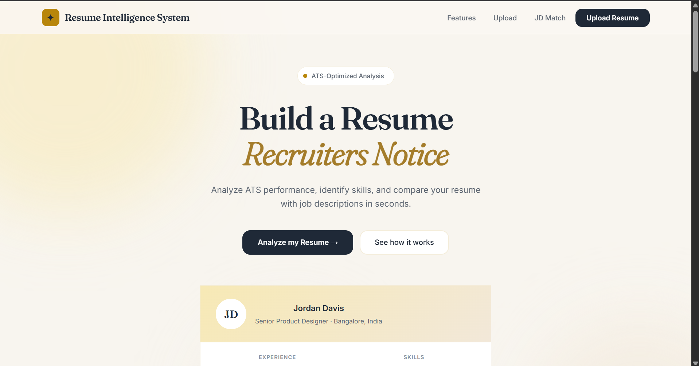
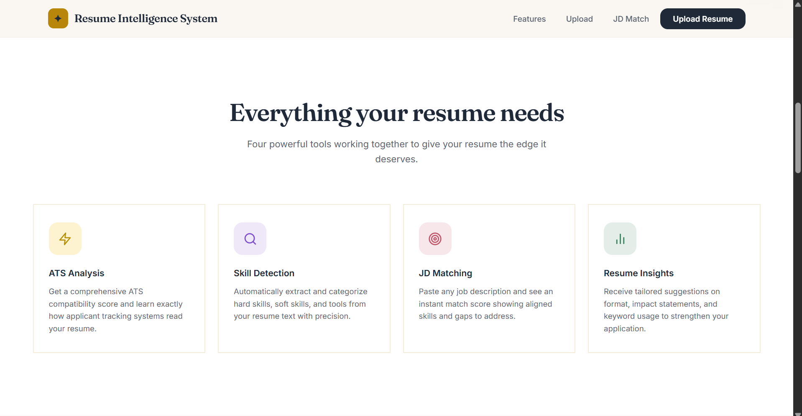
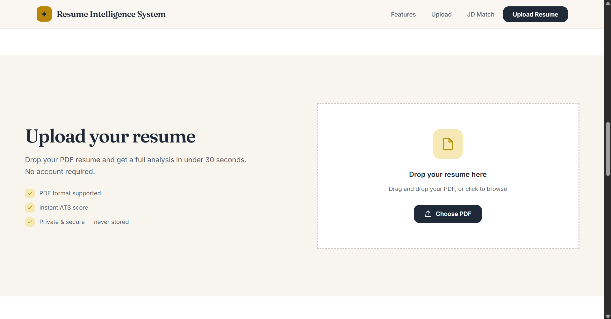
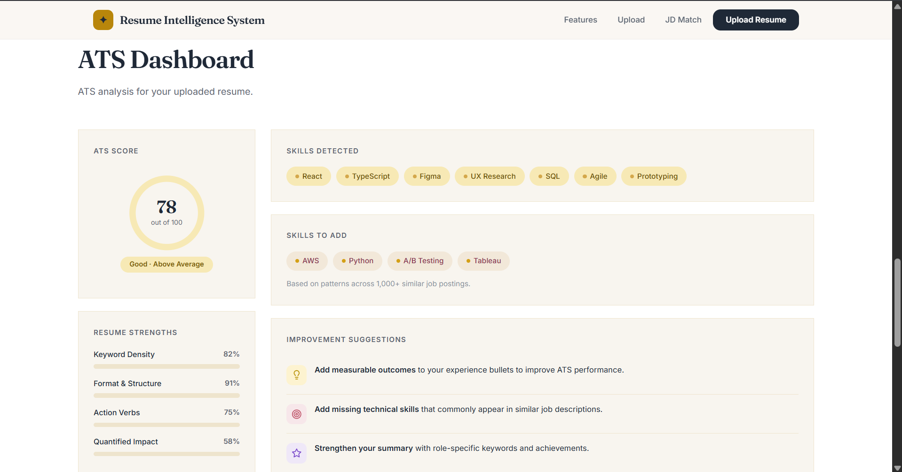
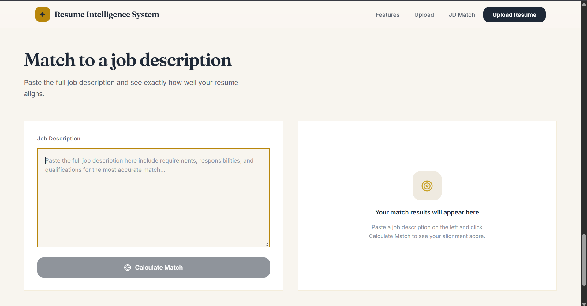

# AI Resume Intelligence Platform

An AI-powered Resume Analysis and Job Description Matching platform that helps candidates evaluate resumes, improve ATS performance, identify missing skills, and measure compatibility with job descriptions.

---

## Features

### ATS Resume Analysis
- Upload PDF resumes
- ATS compatibility scoring
- Resume quality evaluation
- Resume strength analysis
- Personalized recommendations

### Skill Detection
- Automatic skill extraction
- Technical skill identification
- Resume keyword analysis
- Missing skill detection

### Job Description Matching
- Paste any job description
- Resume-to-JD comparison
- Match percentage calculation
- Matched skills detection
- Missing skills identification

### Resume Insights
- ATS improvement suggestions
- Keyword recommendations
- Resume optimization guidance

---

## Screenshots

### Landing Page



### Features Section



### Resume Upload



### ATS Dashboard



### Job Description Matching



---

## Tech Stack

### Frontend
- React
- Vite
- JavaScript
- CSS

### Backend
- FastAPI
- Python

### Resume Processing
- pdfplumber
- pdfminer.six

### Deployment
- Vercel (Frontend)
- Render (Backend)

---

## Project Structure

```text
AI-Resume-Intelligence-Platform/
│
├── backend/
│   ├── routers/
│   ├── services/
│   ├── data/
│   └── main.py
│
├── frontend/
│   ├── src/
│   ├── public/
│   └── package.json
│
├── screenshots/
│   ├── hero.png
│   ├── features.png
│   ├── upload.png
│   ├── ats-dashboard.png
│   └── jd-matching.png
│
├── requirements.txt
├── README.md
└── .gitignore
```

---

## Installation

### Clone Repository

```bash
git clone https://github.com/divyaanshi1308-web/AI-Resume-Intelligence-Platform.git
cd AI-Resume-Intelligence-Platform
```

### Backend Setup

Create virtual environment:

```bash
python -m venv venv
```

Activate environment:

Windows

```bash
venv\Scripts\activate
```

Install dependencies:

```bash
pip install -r requirements.txt
```

Run backend:

```bash
uvicorn backend.main:app --reload
```

Backend URL:

```text
http://127.0.0.1:8000
```

Swagger Docs:

```text
http://127.0.0.1:8000/docs
```

### Frontend Setup

```bash
cd frontend
npm install
npm run dev
```

Frontend URL:

```text
http://localhost:5173
```

---

## API Endpoints

### Upload Resume

```http
POST /upload
```

Returns:

- Name
- Email
- Phone
- LinkedIn
- GitHub
- Skills
- Education
- Experience
- Projects
- ATS Score

### Match Resume To Job Description

```http
POST /match
```

Request:

```json
{
  "job_description": "Paste job description here"
}
```

Response:

```json
{
  "match_percentage": 72,
  "matched_skills": [],
  "missing_skills": []
}
```

---

## Future Improvements

- AI Resume Rewriter
- Resume Version Comparison
- Authentication System
- Resume Templates
- Industry-Specific ATS Scoring
- Interview Preparation Assistant
- Resume Download Generator

---

## Author

### Divyanshi Maheshwari

GitHub:
https://github.com/divyaanshi1308-web

LinkedIn:
https://linkedin.com/in/divyanshi-maheshwari13

---

## License

This project is developed for learning, portfolio, and educational purposes.